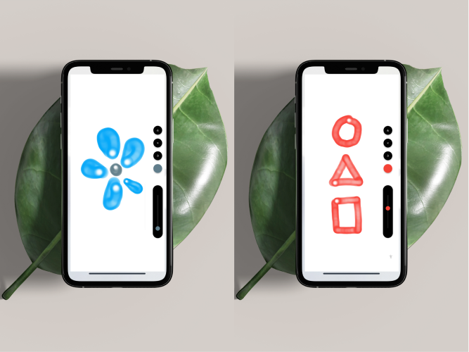

[](https://pub.dev/packages/fancy_text_reveal)  



# 🎨 SketchIt 


### Introduction 🚀

> Watercolor Painting app with meditation theme


### Demo 👀


https://user-images.githubusercontent.com/59445273/170647468-16233a69-0fd2-4b40-a4ea-14c81dc4c2b5.mp4

### Key Features 🔑

* Allows the user to paint canvas.
* Soothing music while painting.
* Users can play around with the color, and thickness and can undo, clear, and save the painting as a png.

### Usage 🔎

To clone and run this application, you'll need [git](https://git-scm.com) and [flutter](https://flutter.dev/docs/get-started/install) installed on your computer. From your command line:

```bash
# Clone this repository
$ git clone https://github.com/Shadow60539/painting_app.git

# Go into the repository
$ cd painting_app

# Install dependencies
$ flutter packages get

# Run the app
$ flutter run
```


### Packages 📦


Package | Description
---|---
[flutter_colorpicker](https://pub.flutter-io.cn/packages/flutter_colorpicker) | HSV(HSB)/HSL/RGB/Material color picker
[just_audio](https://pub.flutter-io.cn/packages/just_audio) | A feature-rich audio player for Flutter
[lottie](https://pub.flutter-io.cn/packages/lottie) | Render animations natively on Flutter.
[image_gallery_saver](https://pub.flutter-io.cn/packages/image_gallery_saver) | A flutter plugin for saving image to gallery.

### Directory Structure 🏢

The project directory structure is as follows:

```
├── android
├── asset
├── audio
├── build
├── images
├── ios
├── lib
├── test
├── analysis_options.yaml
├── pubspec.lock
├── pubspec.yaml

```
